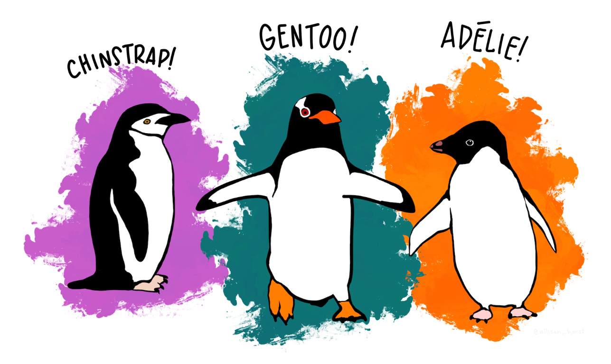

class: middle

.pull-left[
# `r rmarkdown::metadata$title`

### `r rmarkdown::metadata$subtitle`

### `r rmarkdown::metadata$author`

### `r rmarkdown::metadata$institute`

### `r rmarkdown::metadata$date`
]

.pull-right[

]


---
background-image: url("./images/topic03/tidyverse-packages.png")
background-size: contain
background-color: #E8E7E9
class: top, center

```{r setup, include=FALSE}
options(htmltools.dir.version = FALSE)
knitr::opts_chunk$set(results = "hide", 
                      fig.height = 6,
                      warning = FALSE,
                      error = FALSE,
                      message = FALSE)

library(dplyr)
library(ggplot2)
library(palmerpenguins)
library(emojifont)
library(flipbookr)
library(fontawesome)
library(xaringanExtra)
use_xaringan_extra(c("panelset"))
```

.right[Source: [RStudio](https://education.rstudio.com/blog/2020/07/teaching-the-tidyverse-in-2020-part-1-getting-started/)]

---


class: middle center

# Installation

```{r installation, eval = FALSE}
install.packages("tidyverse") #<<
library(ggplot2)
```


---
class: middle center


# Attaching DPLYR

```{r attaching, eval = FALSE}
install.packages("tidyverse") 
library(ggplot2) #<<
```

Alternatively...
```{r alt_attaching, eval = FALSE}
install.packages("tidyverse") 
library(tidyverse) #<<
```
---


# The data 

```{r eval = FALSE}
library(palmerpenguins) #<<
```

```{r penguin_pic, echo = FALSE, out.width='60%', fig.align='center', results = "show"}

```

.footnote[[Artwork by @allison_horst](https://allisonhorst.github.io/palmerpenguins/)]


---
class: top, center


<a href = "https://www.rstudio.com/resources/cheatsheets/">
  
</a>


---
# Grammar of graphics

.pull-left[
`ggplot2` is based on the [*Grammar of graphics*](http://vita.had.co.nz/papers/layered-grammar.pdf), the idea 
that you can build every graph from the same 
components: 
* a data set
* a coordinate system, and 
* geoms—visual marks that represent data points.

To display values, map variables in the data to visual 
properties of the geom (aesthetics) like size, color, and $x$
and $y$ locations.
]

.pull-right[
```{r ggplot_illustration, eval = TRUE, echo = FALSE, out.width='100%', fig.align='center'}
knitr::include_graphics("./images/topic04/ggplot2_masterpiece.png")
```

]

---
name: base_plot

`r chunk_reveal("base_plot", break_type = "user", title = "# The basic structure of a graphic")`
```{r base_plot, include = FALSE}
penguins %>% 
  select(island, 
         species, 
         bill_length_mm, 
         bill_depth_mm, 
         body_mass_g) %>% #BREAK

  ggplot(
    aes(x = bill_length_mm,
        y = bill_depth_mm)) + #BREAK
  
  geom_point() #BREAK
```


---
name: color_plot

`r chunk_reveal("color_plot", break_type = "user", title = "# Mapping color")`
```{r color_plot, include = FALSE}
penguins %>% #BREAK

  ggplot(
    aes(x = bill_length_mm,
        y = bill_depth_mm)) + #BREAK
  
  geom_point(
    aes(color = species)) #BREAK
```

---
name: color_size_plot

`r chunk_reveal("color_size_plot", break_type = "user", title = "# Mapping color and size")`
```{r color_size_plot, include = FALSE}
penguins %>% #BREAK

  ggplot(
    aes(x = bill_length_mm,
        y = bill_depth_mm)) + #BREAK
  
  geom_point(
    aes(color = species,
        size = body_mass_g)) #BREAK
```

---
name: labs_plot

`r chunk_reveal("labs_plot", break_type = "user", title = "# Adding labels")`
```{r labs_plot, include = FALSE}
penguins %>% 

  ggplot(
    aes(x = bill_length_mm,
        y = bill_depth_mm)) +
  
  geom_point(
    aes(color = species,
        size = body_mass_g), 
    alpha = 0.5) +  #BREAK
  
  labs(
    title = "Bill depth and length",
    subtitle = "By species",
    y = "Bill depth (mm)",
    x = "Bill length (mm)",
    color = "Species",
    size = "Body mass (g)") #BREAK
```


---
name: theme_plot

`r chunk_reveal("theme_plot", break_type = "user", title = "# Applying a theme")`
```{r theme_plot, include = FALSE}
penguins %>% 

  ggplot(
    aes(x = bill_length_mm,
        y = bill_depth_mm)) +
  
  geom_point(
    aes(color = species,
        size = body_mass_g), 
    alpha = 0.5) +
  
  labs(
    title = "Bill depth and length",
    subtitle = "By species",
    y = "Bill depth (mm)",
    x = "Bill length (mm)",
    color = "Species",
    size = "Body mass (g)") + #BREAK
  
  theme_dark() #BREAK


```


---
name: more_themes

# Want more themes? Who doesn't??! `r emoji("sparkles")`

.pull-left[
### `ggplot` comes with the following built in themes:
       
`theme_grey()`

`theme_bw()`

`theme_linedraw()`

`theme_light()`

`theme_dark()`

`theme_minimal()`

`theme_classical()`

`theme_void()`
]

.pull-right[
### The `ggthemes` package has many more! `r emoji("heart_eyes")`

### The `ggthemr` package has even more! `r emoji("heart_eyes_cat")`

[Have a look](https://r-charts.com/ggplot2/themes/)
]


---
name: save_me

`r chunk_reveal("save_me", break_type = "user", title = "# Save your graphic")`
```{r save_me, include = FALSE}
penguins %>% 

  ggplot(
    aes(x = bill_length_mm,
        y = bill_depth_mm)) +
  
  geom_point(
    aes(color = species,
        size = body_mass_g), 
    alpha = 0.5) +
  
  labs(
    title = "Bill depth and length",
    subtitle = "By species",
    y = "Bill depth (mm)",
    x = "Bill length (mm)",
    color = "Species",
    size = "Body mass (g)") +
  
  theme_dark() #BREAK

ggsave("beautiful_graphic.png") #BREAK
```

???
`ggsave` saves the last graphic out.  
You can apply options to `ggsave` to change height and width 


---
name: your_turn
background-image: url(images/topic04/penguin_illustration.jpg)
background-position: bottom right
background-size: 35%

# `r fa("check-square")` Your turn

---
template: your_turn

### Use `ggplot` to...

1. Use `geom_point()` to [draw a scatter](#base_plot) of flipper length against body mass
1. Try mapping [color](#color_plot) to distinguish between sexes
1. Add helpful [titles and labels](#labs_plot)
1. Try adding `theme_minimal()` for a clean [look](#theme_plot)
1. Install and attach `ggthemes` and try out some [themes](#more_themes)
1. [Save](#save_me) your graphic

---
# So many geoms!

.panelset[


.panel[.panel-name[geom_col()]

.pull-left[
```{r geom_col, fig.show = "hide"}
penguins %>%
  
  group_by(species) %>%
  
  summarise(avg_weight = mean(body_mass_g, na.rm = TRUE)) %>%
  
  ggplot(aes(x = species, 
             y = avg_weight)) + #<<
  
  geom_col() #<<
```

* By default, `geom_col()` asks categorical $x$ and numeric $y$ aesthetics

* By default, it uses `stat_identity()` to display values

]
.pull-right[
```{r ref.label = "geom_col", echo = FALSE}

```

]

]


.panel[.panel-name[geom_bar()]

.pull-left[
```{r geom_bar, fig.show = "hide"}
penguins %>%
  
  ggplot(aes(x = species)) + #<<
  
  geom_bar() #<<
```

* By default `geom_bar()` asks for a single categorical variable
* By default, it uses an option `stat_count()` to count cases
]
.pull-right[
```{r ref.label = "geom_bar", echo = FALSE}

```

]

]

.panel[.panel-name[geom_line()]

.pull-left[
```{r geom_line, fig.show = "hide"}
penguins %>%
  group_by(year) %>%
  summarise(n = n()) %>%
  ggplot(aes(x = year,
             y = n)) + #<<
  
  geom_line() #<<
```

]
.pull-right[
```{r ref.label = "geom_line", echo = FALSE}

```

]

]


]

---
template: your_turn

1. Use `group_by` and `summarise` to compute average weight over time
1. Use `geom_col` to visualize this pattern
    1. [Save](#save_me) your graphic
1. Compute average weight by species over time
1. Try using `geom_line` to visualize this pattern and map species to color
    1. [Save](#save_me) your graphic
    


---
# So many geoms... for visualizaing empirical distributions!

.panelset[


.panel[.panel-name[Histograms]

.pull-left[
```{r hist_plot_code, fig.show = "hide"}
penguins %>%
  ggplot(aes(x = body_mass_g)) +
  geom_histogram() #<<
```
]

.pull-right[
```{r ref.label = "hist_plot_code", echo = FALSE}

```
]

]


.panel[.panel-name[Density]

.pull-left[

Plain vanilla version
```{r density_vanilla, fig.show = "hide", echo = TRUE}
penguins %>%
  ggplot(aes(x = body_mass_g)) +
  geom_density() #<<
```


Let's add color and transparency (alpha)!
```{r density_plot_code, fig.show = "hide"}
penguins %>%
  ggplot(aes(x = body_mass_g)) +
  geom_density(aes(fill = sex), #<<
               alpha = 0.3) #<<
```
]

.pull-right[
```{r ref.label = "density_plot_code", echo = FALSE}

```
]

]

.panel[.panel-name[Box plots]

.pull-left[
```{r boxplot_code, fig.show = "hide"}
penguins %>%
  ggplot(aes(x = species, #<<
             y = body_mass_g)) + #<<
  geom_boxplot() #<<
```
]

.pull-right[
```{r ref.label = "boxplot_code", echo = FALSE}

```
]
]


.panel[.panel-name[Violin plots]

.pull-left[
```{r violin_code, fig.show = "hide"}
penguins %>%
  ggplot(aes(x = species, #<<
             y = body_mass_g)) + #<<
  geom_violin() #<<
```
]

.pull-right[
```{r ref.label = "violin_code", echo = FALSE}

```
]

]
]


---


template: your_turn

1. Use `group_by` and `summarise` to compute average weight over time
1. Use `geom_col` to visualize this pattern
    1. [Save](#save_me) your graphic
1. Compute average weight by species over time
1. Try using `geom_line` to visualize this pattern and map species to color
    1. [Save](#save_me) your graphic
    


---
# Faceting

.panelset[

.panel[.panel-name[facet-wrap]
.pull-left[
```{r facet_wrap_code, fig.show = "hide"}
penguins %>%
  
  ggplot(aes(x = species,
             y = body_mass_g)) +
  
  geom_violin() + 
  
  facet_wrap(vars(island)) #<<
```
]
.pull-right[
```{r ref.label = "facet_wrap_code", echo = FALSE}

```
]

]


.panel[.panel-name[facet-grid]
.pull-left[
```{r facet_grid_code, fig.show = "hide"}
penguins %>%
  ggplot(aes(x = sex,
             y = body_mass_g)) +
  geom_violin() + 
  facet_grid(island ~ species) #<<
```
]
.pull-right[
```{r ref.label = "facet_grid_code", echo = FALSE}

```
]

]


]


---

class: center, middle

<iframe width="560" height="315" src="https://www.youtube.com/embed/p8Py9C8iq2s" title="YouTube video player" frameborder="0" allow="accelerometer; autoplay; clipboard-write; encrypted-media; gyroscope; picture-in-picture" allowfullscreen></iframe>


