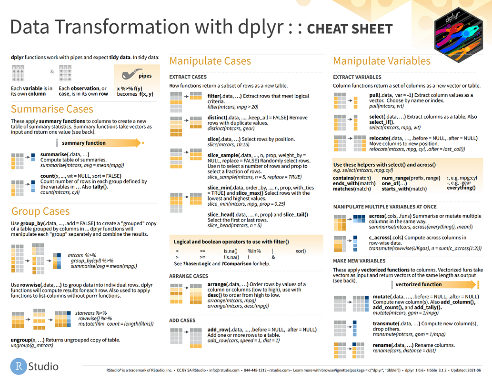
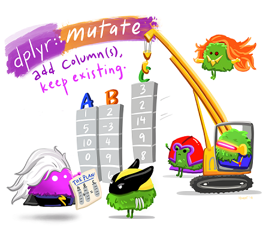

```{r setup, include=FALSE, eval = TRUE}
options(htmltools.dir.version = FALSE)
knitr::opts_chunk$set(eval = FALSE)

library(dplyr)
library(palmerpenguins)
library(emojifont)
library(fontawesome)
library(xaringanExtra)
use_xaringan_extra(c("panelset"))
```

class: middle

.pull-left[

# `r rmarkdown::metadata$title`

### `r rmarkdown::metadata$subtitle`

### `r rmarkdown::metadata$author`

### `r rmarkdown::metadata$institute`

### `r rmarkdown::metadata$date`
]

.pull-right[

]


---
background-image: url("./images/topic03/tidyverse-packages.png")
background-size: contain
background-color: #E8E7E9
class: top, center


.right[Source: [RStudio](https://education.rstudio.com/blog/2020/07/teaching-the-tidyverse-in-2020-part-1-getting-started/)]

---

class: middle center

# Installation

```{r installation}
install.packages("tidyverse") #<<
```


---
class: middle center


# Attaching DPLYR

```{r attaching}
install.packages("tidyverse") 
library(dplyr) #<<
```

--


Alternatively...
```{r alt_attaching}
library(tidyverse) #<<
```

---


# The data 

```{r data}
library(palmerpenguins) #<<
```


```{r penguin_pic, eval = TRUE, echo = FALSE, out.width='60%', fig.align='center'}
knitr::include_graphics("./images/topic03/penguins.png")
```

.footnote[[Artwork by @allison_horst](https://allisonhorst.github.io/palmerpenguins/)]


---
class: top, center


<a href = "https://www.rstudio.com/resources/cheatsheets/">
  
</a>


---


## `dplyr::select()` means "pick columns to keep or exclude"


.left-column[

### `select`

]


.right-column[

1. Pick variables `species` and `island` from the dataset penguins
  ```{r select_demo1}
  head(penguins) # Take a peek first
  select(penguins, species, island) #<<
  ```

1. Pick all variables except `island` and `bill_length_mm`
  ```{r select_demo2}
  select(penguins, -species, -island) #<<
  ```
]


???

```{r}
names(penguins)
```

The main job of `dplyr::select()` is to help you pick which **columns** to keep or exclude.

While making subsets of variables is rarely *necessary* for analyses (and is often unadvised), it can make large data sets with many variables more manageable.


---
class: center, middle

# Piping `%>%` 


```{r piping1}
select(penguins, species, island)
```

... is equivalent to...

```{r piping2}
penguins %>% select(species, island)
```

???
The pipe passes a dataframe to the first argument
You can assign here, too, but I don't usually do this unless I really need the object
https://fontawesome.com/v4.7/icon/check-square-o


---
name: your_turn
background-image: url(images/topic03/penguin_illustration.jpg)
background-position: bottom right
background-size: 35%

# `r fa("check-square")` Your turn

---
template: your_turn

### Use `select()` to...

1. Choose `island`, `sex`, `year`

1. Choose `species`, `bill_length_mm`, `flipper_depth_mm`

1. Choose everything (i.e. drop!) except `flipper_length`

1. Choose everything except `flipper_length` and `year`

    1. Now drop `sex`
    1. Now drop `island`
    1. Now drop `species` and `flipper_length_mm`
    1. What's left?

---


## `dplyr::mutate()` means "create new columns"


.left-column[

### `select`
### `mutate` 
]


.right-column[

]


---

name: mutate_demo
## `dplyr::mutate()` means "create new columns"


.left-column[

### `select`
### `mutate` 
]


.right-column[

.panelset.sideways[

.panel[.panel-name[Compute body mass in kg]
```{r mutate_demo1}
penguins %>%
  mutate(
    body_mass_kg = body_mass_g / 1000 #<<
  )
```
]

.panel[.panel-name[Compute flipper length in cm]

```{r mutate_demo2}
penguins %>%
  mutate(
    flipper_length_cm = flipper_length_mm / 10 #<<
  )
```
]

.panel[.panel-name[Create record number]

```{r mutate_demo3}
penguins %>%
  mutate(
    record_id = 1:n() #<<
  )
```
]


.panel[.panel-name[Combination move]

```{r mutate_demo4}
penguins %>%
  mutate( #<<
    body_mass_kg = body_mass_g / 1000, #<<
    body_mass_lbs = body_mass_kg / 2.2, #<<
    record_id = 1:n() #<<
  )
```


]

]

]


???
`mutate` reads sequentially so you can operate on things you created earlier!

---
template: your_turn

## Use `mutate()` to:


1. Compute bill ratio as the ratio of bill length to depth

1. Compute body mass in lbs (1 gram = 0.0022 lb)

1. Use `tolower()` to convert `island` to lower case

1. Use `as.character()` to convert `species` from factor to character


---


## `dplyr::arrange()` Sort the rows of the dataframe by a column

.left-column[
### `select`
### `mutate`
### `arrange`
]

.right-column[

Arrange the penguins...
.panelset.sideways[
.panel[.panel-name[...from lightest to heaviest]
```{r arrange_demo1}
penguins %>%
  arrange(body_mass_g) #<<
```
]

.panel[.panel-name[...from heaviest to lightest]
```{r arrange_demo2}
penguins %>%
  arrange(-body_mass_g) #<<
```

You can also use `desc()` to arrange descending
```{r arrange_demo3}
penguins %>%
  arrange(desc(body_mass_g)) #<<
```
]

.panel[.panel-name[...from heaviest to lightest and by year]
```{r arrange_demo4}
penguins %>%
  arrange(-body_mass_g, year)  #<<
```
]


]


]

---
template: your_turn


1. Sort the dataframe according to bill ratio (ratio of bill length to depth)
1. Use `head()` to report data from the top 30 heaviest penguins
1. Create a [ranking index](#mutate_demo) of top 10 heaviest Gentoo penguins


---


## `dplyr::filter()` Choose rows of a dataframe 

.left-column[
### `select`
### `mutate`
### `arrange`
### `filter`
]

.right-column[

Find all of the penguins...

.panelset.sideways[
.panel[.panel-name[...of name Gentoo]
```{r filter_demo1}
penguins %>%
  filter(species == "Gentoo") #<<
```
`r emoji("eyes")` Notice how `==` is for equals.  

`r emoji("eyes")` Other useful ones are `!=`, `%in%`, `>=`, and `<=`
]

.panel[.panel-name[...of name Gentoo and female]
```{r filter_demo2}
penguins %>%
  filter(species == "Gentoo" | #<<
           sex == "female") #<<
```
`r emoji("eyes")`  Using `&` requires both conditions to make the `r emoji("scissors")` 

`r emoji("eyes")`  Using `|` only requires  one.


]

.panel[.panel-name[...observed in years 2007 or 2009]
```{r filter_demo3}
penguins %>%
  filter(year %in% c(2007, 2009))  #<<
```

`r emoji("point_up")` This is the same as
```{r filter_demo4}
penguins %>%
  filter(year == 2007 | year == 2009)  #<<
```
but much shorter!
]


]


]


???
filter restricts the dataframe to only those rows that satisfy a set of conditions

---
template: your_turn

.pull-left[
1. Filter the dataset to females of the Adelie species.  How many do you observe?

1. Further filter the dataset to those with body mass between 3kg and 4kg.  How many rows do you observe?

1. Suppose you restrict the dataset on weight before you restrict sex and species.  Show that you get the same number of rows?

1. Create a dataset with females weighing less than 3kg and males weighing more than 4kg

]


---


## `dplyr::summarise()` Describe the data <br>with a ~~statistic`r emoji("scream")`~~ single value 

.left-column[
### `select`
### `mutate`
### `arrange`
### `filter`
### `summarise`
]

.right-column[


.panelset.sideways[

.panel[.panel-name[What is the weight of the heaviest penguin?]
```{r summarize_demo1}
penguins %>%
  summarise(max_weight = mean(body_mass_g)) #<<
```

So many choices!
* `max()` maximum
* `min()` minimum
* `iqr()` interquartile range
* `median()` median
* `mean()` average*
* `sd()` standard deviation*
* `var()` variance*

\* Careful with these.  Inspect your data!
]


.panel[.panel-name[Two (or more) at a time]
```{r summarize_demo2}
penguins %>%
  summarise(min_weight = min(body_mass_g), #<<
            max_weight = max(body_mass_g), #<<
            iqr_weight = iqr(body_mass_g), #<<
            mean_bill_length = mean(bill_length_mm, #<<
                                    na.rm = TRUE))  #<<
```

]


.panel[.panel-name[Focus only on Gentoo]
```{r summarize_demo3}
penguins %>%
  filter(species == "Gentoo") %>% #<<
  summarise(min_weight = min(body_mass_g),
            max_weight = max(body_mass_g),
            iqr_weight = iqr(body_mass_g),
            mean_bill_length = mean(bill_length_mm, 
                                    na.rm = TRUE))
```

]

]

]


???
Summarise aggregates or summarises many rows into a single row.
Be careful with `mean` and `sd` because they won't operate on missing data.


---
template: your_turn

.pull-left[
1. Compute the median, min, and max of `flipper_length_mm`

1. Use `filter` `n()` to count the number of observations on `Dream` island in 2008 and 2009

1. What is the average weight of the penguins observe on `Dream` island in 2008 and 2009?

1. How many observations have missing `sex`?
]


---
class: middle, center

# By the way... can we talk about **Types of Data**? 
# `r emoji("speak_no_evil")` 

## Qualitative vs Quantitative

---
class: middle, center

# By the way... Can we talk about measures of **Central Tendency**? 
# `r emoji("speak_no_evil")` 

## Mean vs Median vs Mode

---
class: middle, center

# By the way... Can we talk about measures of **Dispersion**? 
# `r emoji("speak_no_evil")` 

## Variance 
## Standard deviation 
## Range 
## Inter-quartile range

---
class: middle, center

# By the way... Can we talk about measures of **Co-Movement**? 
# `r emoji("speak_no_evil")` 

## Covariance
## Correlation


---

## `dplyr::group_by()` Break your dataset into groups 

.left-column[
### `select`
### `mutate`
### `arrange`
### `filter`
### `summarise`
### `group_by`
]

.right-column[


.panelset.sideways[

.panel[.panel-name[By sex]
Compare...

```{r group_by_demo1}
penguins %>%
  summarise(num_obs = n())
```

with...

```{r group_by_demo2}
penguins %>%
  group_by(sex) %>% #<<
  summarise(num_obs = n()) 
```


]


.panel[.panel-name[By sex and year]
Compare...

```{r group_by_demo3}
penguins %>%
  summarise(num_obs = n())
```

with...

```{r group_by_demo4}
penguins %>%
  group_by(sex, year) %>% #<<
  summarise(num_obs = n())
```

]


.panel[.panel-name[Find the heaviest species on each island]
Compare...

```{r group_by_demo5}
penguins %>%
  filter(!is.na(sex)) %>%
  
  # Find the mean weight by species and island
  
  group_by(island, species) %>% #<<
  summarise(mean_weight = 
              mean(body_mass_g, na.rm = TRUE)) %>%

  # Find the largest average by island
    
  group_by(island) %>% #<<
  mutate(max_mean_weight = max(mean_weight)) %>%
  filter(max_mean_weight == mean_weight)
```


]


]


]


???
`group_by` is for batch processing.  Used with summarised.
If summarise produces 1 line, how many will it produce if you group by `sex`?
Notice that the grouping variable is kept as are the summarising variables

There are probably more efficient ways of doing this last one!


---
template: your_turn

1. How many observations of each `sex` are in the dataset?

1. How does the distribution of each `sex` vary across islands?

1. How does the distribution of each `species` vary across islands?

1. How have sex species counts varied over time?

---

class: center, middle

<iframe width="560" height="315" src="https://www.youtube.com/embed/p8Py9C8iq2s" title="YouTube video player" frameborder="0" allow="accelerometer; autoplay; clipboard-write; encrypted-media; gyroscope; picture-in-picture" allowfullscreen></iframe>


