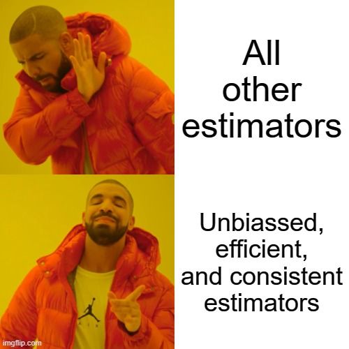

background-image: url("images/topic06/dice_background.png")
class: top, left

.pull-left[
# `r rmarkdown::metadata$title`

### `r rmarkdown::metadata$subtitle`

### `r rmarkdown::metadata$author`

### `r rmarkdown::metadata$institute`

### `r rmarkdown::metadata$date`
]
```{r broadcast, echo=FALSE}
xaringanExtra::use_broadcast()
```

```{r setup, include=FALSE}
options(htmltools.dir.version = FALSE)
knitr::opts_chunk$set(results = "hide", 
                      fig.height = 6,
                      warning = FALSE,
                      error = FALSE,
                      message = FALSE)

library(dplyr)
library(ggplot2)
library(palmerpenguins)
library(emojifont)
library(flipbookr)
library(fontawesome)
library(xaringanExtra)
use_xaringan_extra(c("panelset", "tachyons"))


```

---
class: middle, center
# Data!


# `r emoji("eyes")` Observational 

# Experimental `r emoji("microscope")` 

# `r emoji("game_die")` Simulated

???

* Observational: Data that is gathered by observing, but not manipulating, the world. Stock price data, for example is collected every day: opening and closing prices etc. This has the benefit of being very realistic. But it is more susceptible to different unanticipated effects. It may also not be well suited to the question at hand. Big data is observational data.

* Experimental: Data that is gathered by observing a synthetic or otherwise controlled world. This has the advantage of being well suited to the task at hand; it is designed for the question! It has the disadvanatage of being expensive. It is sometimes criticized for being unrealistic, since the environment is tightly controlled and populations available for the experiment are not always representative of populations of interest. It can be difficult and/or expensive to recruit a lot of subjects. There are ethical restraints on what can be done to subjects in experimental environments.

* Simulated: Simulated are synthetic data sets created without people. They have the advantage of being inxpensive and plentiful, it is not very realistic since the parameters of the model are chosen by the researcher. This kind of data, therefore, is usually used to understanding the importance of different assumptions and behavior of complex systems. It's not very useful for inference. 

---

# Some statistical inference terms

.pull-left[
### Population

### Sample

### Parameter
]

.pull-right[
### Estimator

### Estimate

### Sampling variation

]

???

* Statistical inference is the practice of using sample data to draw conclusions about the characteristics of the population from which the sample came


* Population:  The entire group of items that interests us  

* Sample:  The part of this population that we actually observe  


* Parameter: a characteristic of the population whose value is unknown, but can be estimated 

* Estimator: a sample statistic that will be used to estimate the value of the population parameter

* Estimate: the specific value of the estimator that is obtained in one particular sample

* Sampling variation: the notion that because samples are chosen randomly, the sample average will vary from sample to sample, sometimes being larger than the population mean and sometimes lower


---

layout: true

# What makes for a desirable estimator? `r emoji("kissing_cat")`

---

### Example


Consider a random variable, $X$, the outcome of one roll of a 6-sided die

1. Is $X$ a discrete or continuous random variable? 

2. We can describe $X$ without data because we know its distribution. What is:

    a. its mean?

    b. its variance?

    c. its standard deviation?

3. Suppose we observe the following realisations of $X$:


| 2 | 4 | 5 | 2 | 6 |
|---|---|---|---|---|

 How can we use this data to understand the random variable, $X$?

???

Q2
```{r example_solution}
mean(1:6)
var(1:6)
sd(1:6)
```

Q3 - this is what inferential statistics is all about!

---


### Given data: 2, 4, 5, 2, 6, how do these estimators of $\mu_X$ make you feel?

1. Median

1. Mode

1. Mode + 4

1. $x^{\min}$

1. $\frac{x^{\min} + x^{\max}}{2}$


???
Does anything about theese make you nervous?
Do they have any benefits?
What about bias?

---
layout: false


# 3 desirable properties of estimators...

--

## .blue[UNBIASED...] $\mathbb{E} (\text{Estimator of X}) = \mathbb{E}X$

--

## .blue[EFFICIENT...] $\text{Var}(\text{Estimator of X})$ "small"

--

## .blue[CONSISTENT...] $\lim_{n \rightarrow \infty} \text{Estimator of X} = \mathbb{E}X$

???

Unbiassed: Correct on average

Efficient: Utilizes all the information available

Consistent: Becomes more precise and correct with more data

Show a couple of other estimators. What makes them good or bad estimators?


---
layout: true

# Some desirable estimators 
.pull-left[

]

---
.pull-right[
## The sample mean

* The sample mean is an estimator of which parameter?

* The sample mean is given by $$\bar{x} = \frac{\sum_{i=1}^{N} x_i}{N} $$
]

???
The sample mean is an estimator of the population mean or expected value

Notice that each draw is itself a random variable. So the sample mean is simply a sum of these random variables.

It describes the middle of a sample.

It is a very good estimator. Notice that the sample mean is a linear transformation of n random variables.
$$ \mathbb{E}\bar{X}=\mathbb{E}\left(\frac{\sum_{i=1}^{n}x_{i}}{n}\right)=\left(\frac{\sum_{i=1}^{n}\mathbb{E}X_{i}}{n}\right)=\left(\frac{\sum_{i=1}^{n}\mu}{n}\right)=\frac{n\mu}{n}=\mu $$

Notice also that all possible values are incorporated into the sample mean. No bits are left out. Even the number of observations is information that helps us know the mean. 


]
---

.pull-right[
### Dispersion - the sample variance

* The sample variance is an estimator of which parameter?


* The sample variance is given by $$s^{2}=\frac{(x_{1}-\bar{x})^{2}+(x_{2}-\bar{x})^{2}+\cdots+(x_{N}-\bar{x})^{2}}{N-1}$$
]

???

The population variance $$\mathbb{E}X = \mathbb{E}(X - \mathbb{E}X)^2$$

Again, sample variance is a measure of the variability of a random variable. It is also a manipulation of  $n$ random variables. 

Remember expectation is a linear operator. This is non-linear transformation, so you we cannot pass the expctation through to check unbiassedness.

Note that $\mathbb{E}(X-\mu)^{2}\neq(\mathbb{E}X-\mathbb{E}\mu)^{2}=0^{2}=0$


Again, all information is incorporated. Nothing is left behind.

]


---

.pull-right[
### Co-movement - the sample covariance

* Sample covariance is an estimator of which parameter? 

* The sample covariance is given by $$s_{x,y}=\mbox{cov}(x,y)=\frac{\sum_{i=1}^{n}(x_{i}-\bar{x})(y_{i}-\bar{y})}{N-1}$$


]

???
Population covariance $$text{COV}(R_{\text{APL}},R_{\text{S\&P}})=\mathbb{E}(R_{\text{APL}}-\mu_{\text{APL}})(R_{\text{S\&P}}-\mu_{\text{S\&P}})$$

Beware: the sample covariance is sensitive to scale!


---

.pull-right[
### Correlation - the sample correlation

* The sample correlation is an estimator of which parameter?

* The sample correlation is given by $$r_{x,y}=\frac{s_{x,y}}{s_{x}s_{y}}$$

]
???
the population correlation \[\rho=\frac{\sigma_{X,Y}}{\sigma_{X}\sigma_{Y}}\]

* The sample correlation is bounded between -1 and 1

    + At 1, perfect positive (linear) correlation
    + At -1, perfect negative (linear) correlation
    + At 0, no (linear) correlation


---

layout: false

class: middle, center


# Hold on...

--

# The estimator depends on the data...

--

# So the estimator itself is a random variable...

--

# So it must have a distribution...

--

# The .blue[sampling distribution]! `r emoji("eyes")`

???
What if we drew another sample? What would happen to our estimate of the mean and variance?
It would be different - this is sampling variation

BIG idea: Estimators are themselves random variables!

The sampling distribution of a statistic is the probability distribution that describes the population of all possible values of this statistic.

---
class: center, middle

## Central Limit Theorem

### The sampling distribution of the sample mean will approach a Normal distribution as the sample size increase and has the following parameters:

$$\text{Mean of }\bar{X}	=\mu$$

$$\text{Std. Dev. of }\bar{X}	= \sqrt{\frac{\sigma^{2}}{N}}=\frac{\sigma}{\sqrt{N}}$$

---

# Let's try it out!
# A standardized sampling distribution - $Z$

* Let $X$ be a random variable with mean $\mu$ and standard deviation $\sigma$ i.e. $X \sim N(\mu,\sigma)$

* Then the (standardized) mean,
$$ Z = \frac{\bar{X} - \mu}{\sigma / \sqrt{N}} $$
is distributed $N(0,1)$

* In practice, there is (oftentimes) a problem... `r emoji("grimacing")`


???
If the population standard deviation is known, then this is fine.  Lab rats, for example.

We can assume $\mu$ under some circumstances but what should we use for $\sigma$? If we use the sample estimator, $s$ , then we first need to calculate the mean! So the distribution of the $\bar{X}$ is part of the distribution of $s$.

---


# Let's try it out!
# A standardized the sampling distribution - the $t$ distribution

Let $X$ be a Normally distributed random variable with mean $\mu$ and standard deviation $\sigma$ (or $X\sim N(\mu,\sigma)$ for short). Then the (standardized) mean,

$$t=\frac{\bar{X}-\mu}{s/\sqrt{N}} \equiv \frac{\bar{X}-\mu}{s.e.(\bar{X})}$$
where $s.e.(\bar{X})=\frac{s}{\sqrt{N}}$ (called the Standard Error of $\bar{X}$) and $s$ is the sample standard deviation distributed Student's $t$, with $N-1$ degree of freedom. 

???
Degrees of freedom reflect that $N-1$ observations are free to vary without changing the statistic. The last observation is not free - it will plug the distribution to restore the statistic.


---

# Inference is very useful!
## Confidence intervals

A confidence interval is an estimate of an unknown parameter that explicitly recognizes our degree of uncertainty.  Compute confidence intervals using the following procedure:

1. Calculate the sample mean $\bar{X}$

2. Calculate the standard error of $\bar{X}$ (i.e. the $s.e.(\bar{X})$)

3. Select a confidence level (oftentimes 95%) and identify $t^\mbox{crit}(N-1)$ in a $t$-Table with $N-1$ degrees of freedom
<!-- That is, determine the number of standard deviations from zero, this probability represents -->

4. Compute a confidence interval for the population mean as \[\bar{X}\pm t^\mbox{crit}(N-1) \times s.e.(\bar{X})\]
<!-- If this is in the rejection region, reject the null in favor of the alternative -->

---
# Inference is very useful!
## Hypothesis testing: Testing a single mean

Hypothesis testing is about determining if enough evidence exists to convince us whether a particular hypothesis is wrong. The general steps for performing a hypothesis test are as follows:
<!-- Suppose you toss a coin X times. It comes up Heads each time!  -->

<!-- Notice that as the evidence builds up, the more confident you can be that your assumption is wrong.  -->

<!-- What is your starting hypothesis? That the coin is fair. You are gathering evidence that says the coin is not fair. If we tossed the coin 10,000 and it always produced a head, are you 100% certain that the coin is not fair? No. It's still possible.  -->

<!-- What if you began assuming that the coin has two heads? You could do this. But then the data is simply reinforcing your hypothesis. What do you learn by seeing the data? Nothing! -->

<!-- What would be enough evidence to prove that this conclusion is wrong? A single Tail.  -->

1. Generate Null and Alternative hyptheses about population parameters

2. Choose a confidence level

    + Type I Error: Rejecting a true null
<!-- Rejecting a true null hypothesis - Even though you observe many Heads, the coin is in fact fair!  -->
    + Type II Error: Failing to reject a false null
<!-- Not rejecting a false null hypothesis - You observe 100 of every kind of dice outcome in 600 rolls but actually the dice is loaded! -->

<!-- In this step, we are choosing the probability of rejecting a false Null hypthesis -->

3. Compute critical values and sample statistics

<!-- To test a hypothesis, we calculate a sample statistic that determines when the null hypothesis can be rejected depending on the magnitude of that sample statistic relative to a pre-selected critical value (which is found in a statistical table). This procedure is referred to as a decision rule The decision rule is formulated before regression estimates are obtained The range of possible values of the estimates is divided into two regions, an "acceptance" (really, non-rejection) region and a rejection region The critical value effectively separates the "acceptance"/non-rejection region from the rejection region when testing a null hypothesis -->

4. Determine whether the data represents sufficient evidence to reject the Null hypothesis in favor of the alternative

---

# Inference is very useful!
## Example

Sugar sales vary little hovering randomly around a mean sales level of $1.4M per month. Management wants to know if a recent rebranding has had any effect (at the 5% significance level). The following sales levels over the last 12 months are below.


| Mo: | 1 |	2	| 3	| 4	| 5	| 6	| 7	| 8	| 9	| 10 | 11 | 12 
| --- | --- |	---	| ---	| ---	| ---	| ---	| ---	| ---	| ---	| --- | --- | --- 
| $M	| 1.1	| 1.2	| 1.7	| 2.1	| 1.5	| 1.3	| 1.2	| 1.1	| 1.5	| 1.6	| 1.9	| 2.1

Has the rebranding has an effect on sales at the 5% level?

---

# Inference is very useful!

## Example continued
1. Null hypothesis:
Alternative hypothesis:
2. Confidence level: 95%
3. Critical values for $df=12-1$: 
4. t-calc:
Conclusion:
```{r, eval = FALSE, echo = FALSE, warning = FALSE}
sales <- c(1.1, 1.2, 1.7, 2.1, 1.5, 1.3, 1.2, 1.1, 1.5, 1.6, 1.9, 2.1)
month <- 1:12
df.sales <- data.frame(month, sales)
library(ggplot2)
ggplot(df.sales, aes(x = month, y = sales)) + geom_line()

library(dplyr)
df.sales %>% 
  summarise(mean.sales = mean(sales), 
            sample.size = n(),
            deg.freedom = sample.size - 1,
            sd.sales = sd(sales),
            std.err.sales = sd.sales / sqrt(sample.size),
            t.calc = (mean.sales - 1.4) / std.err.sales,
            t.crit = qt(0.975, df = deg.freedom, lower.tail = TRUE),
            p.val = pt(t.calc, df =  deg.freedom, lower.tail = TRUE),
            low.bound = mean.sales - t.crit * std.err.sales,
            up.bound = mean.sales + t.crit * std.err.sales)

t.test(sales, mu = 1.4, conf.level = 0.95, alternative = "two.sided")

```

---
## Example
.pull-left[
Let's illustrate the central limit theorem by simulating a non-normal distribution.

1. Use **runif** to simulate a sample of size 3 of the random variable $X \sim U(5,15)$ 

2. Use **hist** to visualize the distribution of your sample

3. Use **replicate** to draw 1000 such samples and to compute their means

4. Use **hist** to visualize the distribution of means

]

.pull-right[
```{r, eval=FALSE}
df_sim_x <- data.frame(x = runif(3, min = 5, max = 15))
df_sim_x %>% ggplot(aes(x = x)) + geom_histogram()

df_sim_mean_x <- data.frame(
  x = replicate(1000,
                mean(runif(4, min = 5, max = 15))))

df_sim_mean_x %>% ggplot(aes(x = x)) + geom_histogram()

```


---

# Try for yourself!
Try the previous exercise on random variable $Y = \sqrt{X}$


